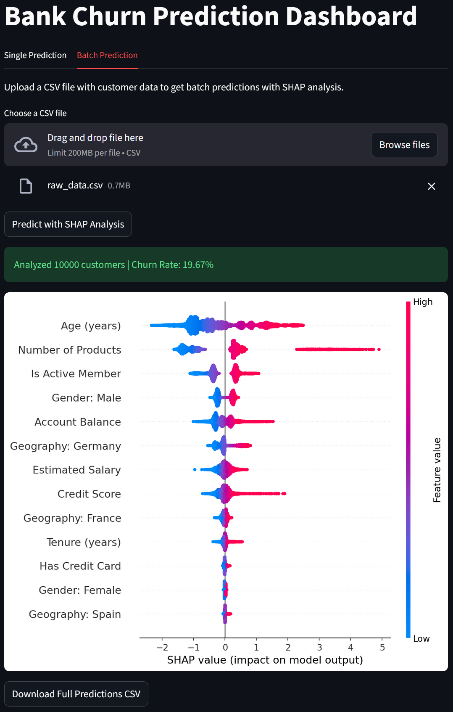

# Bank Customer Churn Analytics Project

## Overview

Customer churn occurs when customers stop doing business with a company. In the banking industry, this typically means a customer closing their account or ceasing to use a bank's services in favor of a competitor. 

## Project Goals

- Find segments of the customer base which contain high value churners which are cost effective for targeted retention strategies using a simple rule-based approach.
- Develop a predictive model for identifying the churn risk per customer.
    - Evaluate developed model's effectiveness at stratifying the population into high value segments.
    - Implement an API endpoint for serving single customer churn predictions as well as batch predictions.
    - Implement an interactive application for churn predictions with explainable visualizations.

## Data Description

- **Source**: [Kaggle dataset 'mathchi/churn-for-bank-customers'](https://www.kaggle.com/datasets/mathchi/churn-for-bank-customers)
- **Size**: 10,000 unique customer records
- **Features**: See [here](data/dictionaries/feature_dictionary.md) for full feature descriptions
    - Customer identifiers (3): RowNumber, CustomerId, Surname
    - Demographic (3): Geography, Gender, Age
    - Account info (4): Tenure, Balance, NumOfProducts, HasCrCard, IsActiveMember
    - Financial metrics (2): EstimatedSalary, CreditScore
    - Churn indicator: Exited
        - Class imbalance - ~20% churn rate

## Key Metrics

We say that a subset of the population is high value if there is a higher concentration of churned balance relative to customer count. Specifically we will be looking at the ratio 

$$
\text{Value of group} = \frac{\text{Percent of churned balance attributed to the group}}{\text{Percent of population from the group}}
$$

A high value segment, say value > 2, indicates that one would recover at least twice the amount of churned balance when targeting that segment compared to a random selection of customers of the same size. In particular our goal is to find segments of the population which are of high value with high precision.

Another criteria to look for is the churn rate of these groups as higher churn rates would indicate reduced cost from applying resources to non-churners.

## Summary Findings

- Rule-based strategy: 
    - Customers with 3+ products have very high-value churners with small population and high churn rate
        - Individualized high-cost retention strategies could be used here
    - Customers based in Germany have high-value churners with high churn rates but large population.
        - Take a deep-dive to possibly reveal any systematic issues in this branch.
    - In addition the group ofcustomers who satisfy both of the following criteria also have high-value churners with a lower risk of targeting non-churners:
        - Customers in the age bracket 50-60
        - Customers with balance >100K and in the age bracket 40-70
    - The group of customers of satisfying any of these conditions
        - constitutes ~40% of the customer base,
        - has a churn rate of 35% (+15% over total population), 
        - and value of 2.085
- .Predictive Model:
    - Able to identify a block of similar size and value but with 40% churn rate (+5% over rule-based strategy).
    - In addition the model effectively stratifies the customer base into bins of varying levels of value and churn rate.
        - Can be used to accurately assign retention strategies of varying resource and cost level to the correct customer profile groups, i.e. Individualized high-cost strategies for small very high value and churn rate groups or large scale low resource strategies for large above average value and churn rate groups.

## Notebook Overview

- [Data Quality and Exploratory Data Analysis](notebooks/0.data_exploration.ipynb) - Data quality checks, univariate/bivariate analysis, multicollinearity assessment
- [Customer Churn Prediction Model](notebooks/1.churn_predict_binary.ipynb) - Model development workflow
- [Customer Segment Value Analysis](notebooks/2.high_value_segments.ipynb) - Rule-based segmentation, predictive model evaluation using threshold analysis

## Installation and Setup

1. Clone the repository:
```bash
git clone https://github.com/JohnsonGJTan/Bank_Churn.git
cd Bank_Churn
```
2. Install dependencies and src:
```bash
pip install -r requirements.txt
pip install -e .
```
3. Set Kaggle credentials (see .env.example for template).
```bash
# Example Environment Variables
# Copy this file to .env and fill in your actual values

KAGGLE_USERNAME=your_username_here
KAGGLE_KEY=your_api_key_here
```
4. Run `invoke reproduce` in project root to reproduce results.

## Usage

### API

1. Start the API server
```bash
invoke start-api  # Runs at http://127.0.0.1:8000
```
**Endpoints:**
- `GET /` - Health check
- `POST /predict` - Single customer prediction
- `POST /predict-batch` - Batch predictions

**Example Request:**
```python
import requests

payload = {
    "CreditScore": 650,
    "Geography": "France",
    "Gender": "Female",
    "Age": 42,
    "Tenure": 5,
    "Balance": 80000.0,
    "NumOfProducts": 2,
    "HasCrCard": 1,
    "IsActiveMember": 1,
    "EstimatedSalary": 75000.0,
    "compute_shap": True
}

response = requests.post("http://127.0.0.1:8000/predict", json=payload)
result = response.json()
# Returns: {"churn_prediction": 0, "churn_probability": 0.23, "shap_values": {...}}
```

### Application

Streamlit dashboard for interactive churn prediction with explainable AI visualizations.

**Start App:**
```bash
invoke start-streamlit  # Runs at http://localhost:8501
invoke start-all        # Start both API and app together
```
**Images**



### Running Scripts

| Task | Command |
|------|---------|
| Data preparation | `invoke build-data` |
| Run EDA notebook | `invoke run-data-nb` |
| Run model development notebook | `invoke run-model-nb` |
| Build predictive model pipeline | `invoke build-pipeline` |
| Run customer value analysis notebook | `invoke run-value-nb` |
| Reset project directory | `invoke clean` |
| Start API for model prediction | `invoke start-api` |
| Start streamlit app | `invoke start-streamlit` |
| Start API and app | `invoke start-all` |
| Kill API and app | `invoke stop-all` |